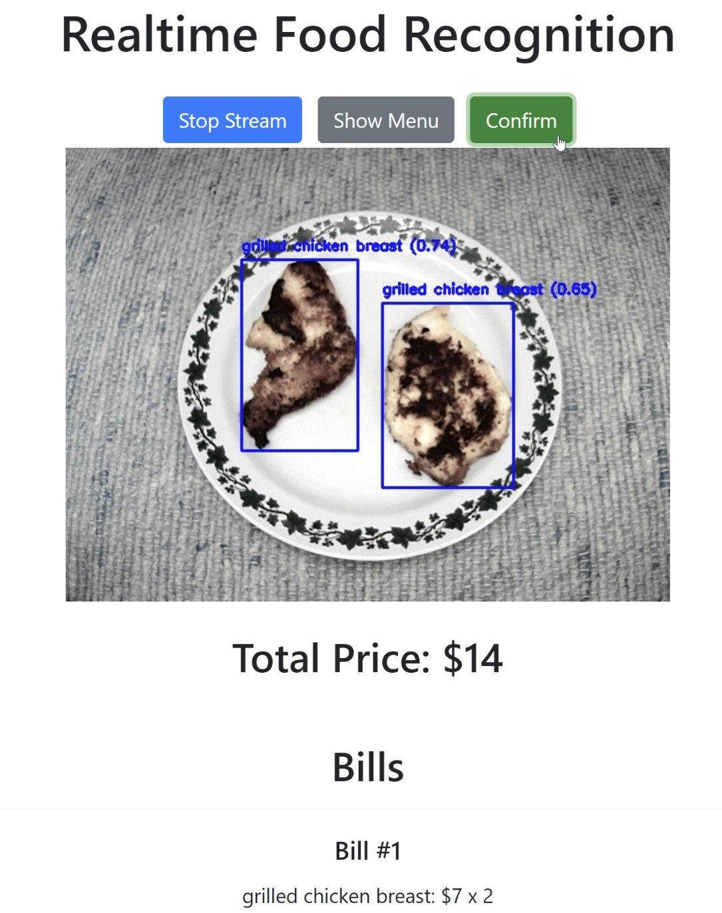
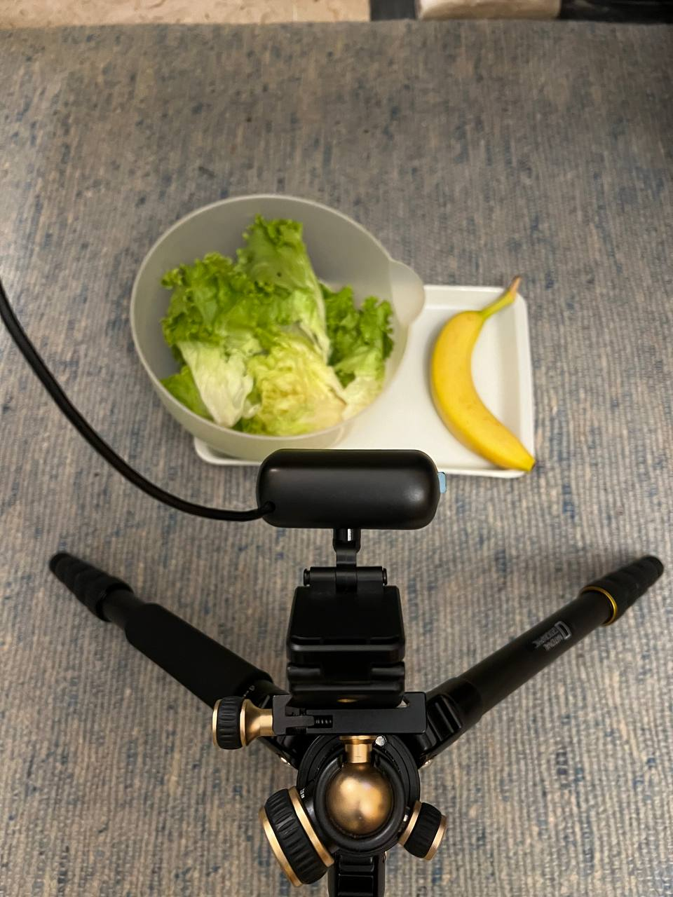
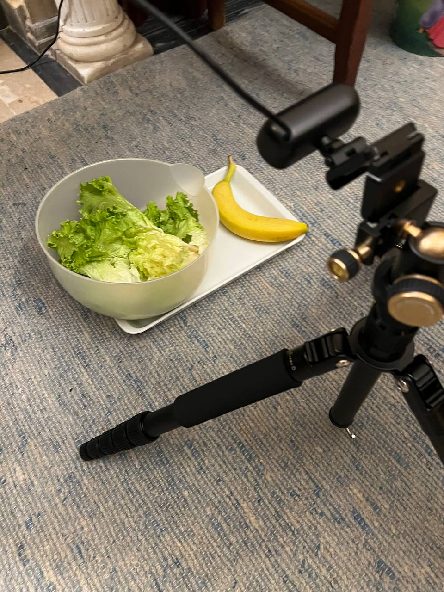

# 🍽️ Real-Time Food Detection System
This project was inspired by some innovative restaurant payment methods i've seen around, which implement real-time object detection to determine the price to pay.

I tried to recreate a similar system, developed as a simple web application using Flask, where the backbone network is a [YOLOv8](https://docs.ultralytics.com/) model, which i fine-tuned on food images. 

The price is adjusted in real-time as the webcam detects one or more food items, and the price tag is updated accordingly.



## 🥗 Menu
Here is the list of food items that the system can detect along with their corresponding prices:

- **Banana**: $5
- **Black Beans**: $4
- **Grilled Chicken Breast**: $7
- **Milk**: $2
- **Orange Juice**: $3
- **Pizza**: $8
- **Potato**: $3
- **Salad**: $5
- **Spaghetti**: $10
- **White Rice**: $5

These food classes are just the ones contained in the '[Food Detection Image Dataset](https://universe.roboflow.com/food-hofna/food-detection-fme3o/dataset/8)', that i used for fine-tuning the YOLO model. 
However, it is fully customizable for personal use if someone wants to create a personal food dataset.

## 🎥 Webcam Integration
- **Logic**: Capture real-time video feed from the webcam and detect food items.
- **Realtime Streaming**: Stream video feed to the web browser.

This system uses a webcam to capture real-time video feed, which is then processed by a YOLOv8 model fine-tuned on food images. The model detects food items with a confidence threshold of 0.5 and calculates the total price based on the detected items. For instance, a detected 'spaghetti' adds $10 to the total, while a 'orange juice' adds $3.

## 💲 Price Calculation
- **Logic**: Calculate the total price based on detected items.
- **Detected Items**: Update price in real-time as new items are detected.

Users can press "Confirm" to generate a bill containing the price of each item detected along with the total price. The "Menu" button allows users to visualize the food list along with the associated prices.

## 📊 Video Visualization
The web application streams the video feed to the front end with bounding boxes and labels showing the detected items and their confidence scores, and updates the total price dynamically.

This ensures that users can see the price in real-time as they place more items in front of the camera.

## 🏗️ System Architecture
1. **Video Capture**: Using OpenCV to capture video from the webcam.
2. **Model**: YOLOv8 fine-tuned on food images.
3. **Web Application**: Flask for creating the web interface and streaming the video feed.
4. **Real-Time Updates**: Flask-SocketIO for updating the price dynamically based on detected items.

## 📹 Demo Video
Watch the demo video below to see the Real-Time Food Detection System in action:
[](https://www.youtube.com/watch?v=4eRQTrln_ag)

Actual setup during video recording:

<div style="text-align: center;">
    
    
</div>

## 🛠️ Setup and Local Deployment
1. Clone the repository:
```bash
git clone [your-repo-url]
cd RealTimeFoodDetection
```

2. Create and activate a virtual environment:
```bash
python -m venv .venv
source .venv/bin/activate  # On Windows: .venv\Scripts\activate
```

3. Install dependencies:
```bash
pip install -r requirements.txt
```

4. Run the application:
```bash
python app.py
```

5. Open your web browser and navigate to:
```
http://127.0.0.1:5000
```

6. Allow camera access when prompted

7. Point your camera at food items to see real-time detection and pricing

## Requirements
- Python 3.12+
- Flask
- Flask-SocketIO
- OpenCV
- Ultralytics (YOLOv8)
- PyTorch

(if you enjoyed this content please consider leaving a star ⭐)
